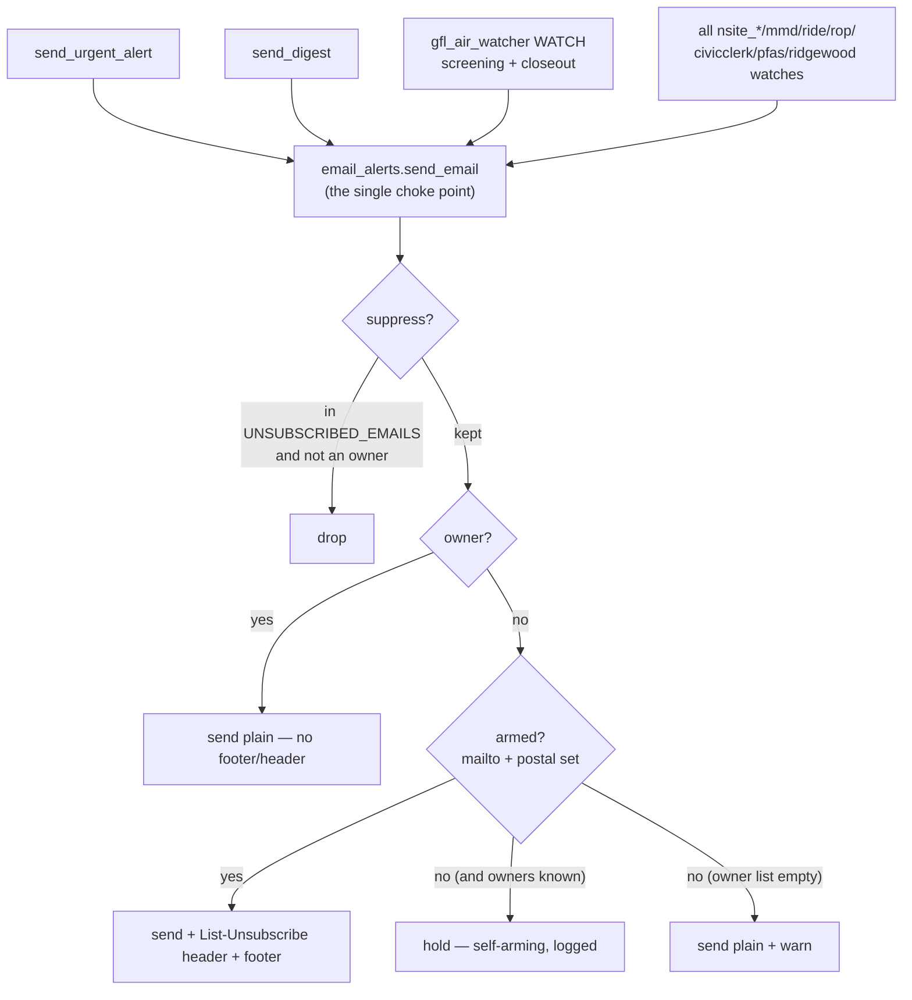

# ADR 040 — CAN-SPAM unsubscribe for the multi-recipient alert emails

**Status:** accepted (2026-09-10) · applies to the LIVE outbound-mail path ·
opened as a **draft PR for Trisha's review — NOT auto-merged** (it changes real
outbound mail AND needs her postal-address decision; overnight-coder Step 8).

## Context

The monitor sends three email streams that go to **more than just Trisha** — the
only >1-recipient streams she has confirmed:

1. **GFL-air perimeter action-level WATCH** (the consolidated screening/closeout
   email — ADR 039; recipients `gfl_air.watch_alert_recipients` +
   `GFL_AIR_WATCH_RECIPIENTS_EXTRA`).
2. **The Sunday digest** (`email_alerts.send_digest`; `alert_recipients` +
   `ALERT_RECIPIENTS_EXTRA` + `DIGEST_RECIPIENTS_EXTRA`).
3. **The same-day `[URGENT]` alerts** (`alert_recipients` + `ALERT_RECIPIENTS_EXTRA`).

`config.yml`'s committed `alert_recipients` already contains a third party today
(`hwangr@umich.edu`, Roland Hwang) — so this is a live CAN-SPAM exposure now, not
only when the county commissioners (and later the MMPC committee) join the lists
around 2026-09-17. CAN-SPAM requires every such message to carry a working opt-out
(honored within 10 business days), a valid physical postal address, and a clear
sender identity. This should land **before** the 9/17 expansion.

## Feasibility spike (Step 1 — it picks the mechanism)

Grepped the send path: it is **plain SMTP** (`email_alerts.send_email` →
`smtplib.SMTP(...).starttls().login().send_message()` per recipient). There is
**no Resend** anywhere in the repo, and **no web backend** (the site is static
GitHub Pages). Therefore:

- The mechanism is a **`List-Unsubscribe: <mailto:…>`** header (RFC 2369) plus a
  compliant footer. Mail clients render a native "Unsubscribe" button for a
  mailto-only header.
- **RFC 8058 one-click (`List-Unsubscribe-Post`) is NOT used** — it requires an
  HTTPS POST endpoint the project has no backend for, and the handoff explicitly
  forbids standing one up.

## Decision

### 1. One choke point — `email_alerts.send_email`

Every stream already funnels through `send_email` — urgent (`send_urgent_alert`),
digest (`send_digest`), the GFL-air WATCH (`gfl_air_watcher.py` →
`ea.send_email(subject, body, cfg, recipients=watch_recipients)`), and every
`nsite_*` / `mmd` / `ride` / `rop` / CivicClerk / PFAS / Ridge Wood watcher. So
suppression and the CAN-SPAM apparatus are applied **there and only there** — no
per-stream wiring, and **no other module is touched** (notably not
`gfl_air_watcher.py` or `sheet_writer.py`, both owned by a concurrent session).
A useful side effect: **all** multi-recipient sends become uniformly compliant,
not just the three named streams, and any future stream inherits it for free.

### 2. Suppression store — an env secret, deliberately not a Sheet/config

Suppressed addresses come from the **`UNSUBSCRIBED_EMAILS`** env secret
(comma/semicolon list; same shape as the existing `ALERT_RECIPIENTS_EXTRA`
private-supplement pattern). It is **not** the `Unsubscribes` Sheet tab the
handoff floated, and not `config.yml`: a suppression list is third-party PII, and
both the case-file Sheet and `config.yml` are **PUBLIC**. Keeping it in a private
secret is the PII-safe choice. Filtering is case-insensitive and whitespace-
trimmed.

### 3. Owner self-guard — Trisha's own addresses are never suppressible

The never-suppressed / never-held / never-footered owner set is the **union** of
`unsubscribe.owner_addresses` in config (fine in a public repo for a
non-sensitive address like the `arbor-hills@` catch-all, which is already public
in `alert_recipients`) and the **`MONITOR_OWNER_EMAILS`** env secret (for her
private proton/gmail addresses, which must not be committed). An owner address is
removed from the suppression set before filtering, so even a mistaken entry can
never lock her out.

### 4. Apparatus, per recipient — armed by the postal address, no `enabled` flag

Because `send_email` loops per recipient, the apparatus is decided per message:

- A **non-owner** recipient's message gets the `List-Unsubscribe` mailto header
  (carrying that recipient's own address in the body, so triage knows exactly
  whom to add to `UNSUBSCRIBED_EMAILS`) **and** a footer with the sender identity,
  the postal address, and the opt-out line.
- An **owner** recipient's message is unchanged — no header, no footer.
- The apparatus is **armed only when both `unsubscribe.mailto` and
  `unsubscribe.postal_address` are set.** There is deliberately **no `enabled`
  flag** — "postal address configured" is itself the switch. A disabled-by-default
  flag would recreate the exact compliance gap before 9/17.

### 5. Self-arming fail-safe (unarmed = can't be compliant)

When the apparatus is **not** armed (postal address blank), a non-owner recipient
is **held (not sent)** rather than sent a non-compliant commercial message — it
self-arms the instant Trisha fills in the postal address. Owners are always sent.
The one exception is a safety valve: if the **owner list is empty** we cannot tell
who is a third party, so we do **not** drop anyone (never risk silencing Trisha)
and instead print a loud warning. Held recipients are always logged by name.

### 6. Topology

### 7. Trap guards baked in (with tests)

- **Trap 1 — no private-list leak.** An explicitly-passed (scoped) list that is
  emptied by suppression sends to **nobody**; it never falls through to the
  default `alert_recipients` coalition audience (that fallthrough only runs when
  no list was passed at all).
- **Trap 4 — URGENT never a spurious `False`.** `send_email` returns `True` iff at
  least one message was sent. The URGENT path always includes an owner, who is
  never suppressed or held, so the send is never empty → `send_urgent_alert` never
  wrongly returns `False`, which would make `watcher._route_urgent_or_digest`
  silently skip **and** never recap the doc.
- **Trap 3 — empty owner list is loud, not silent.** A non-empty suppression list
  with an empty owner list prints a warning and drops no one on the fail-safe path.

## Open decisions for Trisha (surfaced, NOT decided here)

1. **The physical postal address to print.** Required by CAN-SPAM; a PO box is
   fine. `unsubscribe.postal_address` ships **empty** on purpose so nothing goes
   out with an invented address — filling it is what arms the apparatus.
2. **Opt-out granularity.** v1 is **GLOBAL** (unsubscribe = all monitor mail),
   which the choke-point architecture naturally yields (`send_email` doesn't know
   the stream). Per-stream opt-out is a documented follow-on. Recommend keeping
   global for v1 (simplest, safest).
3. **Capture path.** v1 is a mailto to a monitored inbox (`unsubscribe@
   trishakunst.com`) + **manual triage** into the `UNSUBSCRIBED_EMAILS` secret
   (the list is tiny). Auto-reading the mailbox is a documented follow-on; the
   natural migration target is a **private** `Unsubscribes` tab on
   `GSHEET_ID_PRIVATE` (never the public Sheet), read at send time.

## Adversarial review (plan-hardening rule)

- **What could go wrong — a legitimate subscriber silently stops receiving mail.**
  Pre-config (postal address unset), the fail-safe holds `hwangr@umich.edu`.
  *Detect:* every held recipient is logged by name in the workflow output.
  *Recover:* set `unsubscribe.postal_address` (self-arms immediately); it is a
  prominent "Before merging" item, and the PR is a draft gated on that decision.
- **What could go wrong — owner misconfiguration drops Trisha's own alert.** If an
  owner address on a list is missing from the owner set, the fail-safe could hold
  it. *Mitigation:* the non-sensitive `arbor-hills@` catch-all is protected by
  default in `config.yml`, and the requirement to list **every** owner address is
  documented at the config, the secret, and here. *Detect:* held-recipient log +
  the empty-owner-list warning.
- **What could go wrong — the native Unsubscribe button doesn't render.** Gmail's
  one-click UI also needs From-domain authentication (SPF/DKIM/DMARC) aligned.
  This is **not** verifiable from the code or hermetic tests (local SMTP creds are
  placeholders) — flagged as a pre-live check below (residual, Trisha's).

## Verification

- `pytest -q` green (1464 total; 20 new in `tests/test_unsubscribe.py`).
- The 20 tests cover the handoff's five required cases (suppressed dropped from
  each stream; owner never dropped; header present + well-formed per stream;
  add-then-remove round-trip; empty list no-op) plus the traps above, and — per
  the review bar for a live-mail change — **serialize a real `EmailMessage` from
  each of the three streams** and assert the actual `List-Unsubscribe:` header and
  footer text on the wire (not just pure-function asserts).
- `bandit==1.9.4`: 0 medium / 0 high on the changed Python.

## Before merging (Trisha's steps)

1. Decide + set `unsubscribe.postal_address` in `config.yml` (arms the apparatus).
2. Set two GitHub Secrets: **`MONITOR_OWNER_EMAILS`** (ALL of Trisha's own
   addresses that appear on any list — proton/gmail + the `arbor-hills@` catch-all)
   and **`UNSUBSCRIBED_EMAILS`** (starts empty). These pass through `daily.yml`
   (urgent + digest) and `gfl-air.yml` (WATCH).
3. **Pre-live check (residual, can't be tested here):** send one real message to a
   test inbox and confirm the native Unsubscribe button appears and SPF/DKIM/DMARC
   are aligned for the From domain.

## Consequences

- All multi-recipient monitor mail carries a compliant unsubscribe once armed; one
  shared suppression list, honored at one choke point, drops opted-out addresses
  from every stream; Trisha's own addresses can never be suppressed or held.
- Until the postal address is set, non-owner recipients are held (compliance-safe,
  logged) — a deliberate self-arming behavior, not a silent failure.
- No new module, no Sheet write, no web backend; the only shared file with the
  concurrent GFL session is `config.yml` (a new, textually-disjoint top-level
  block).
